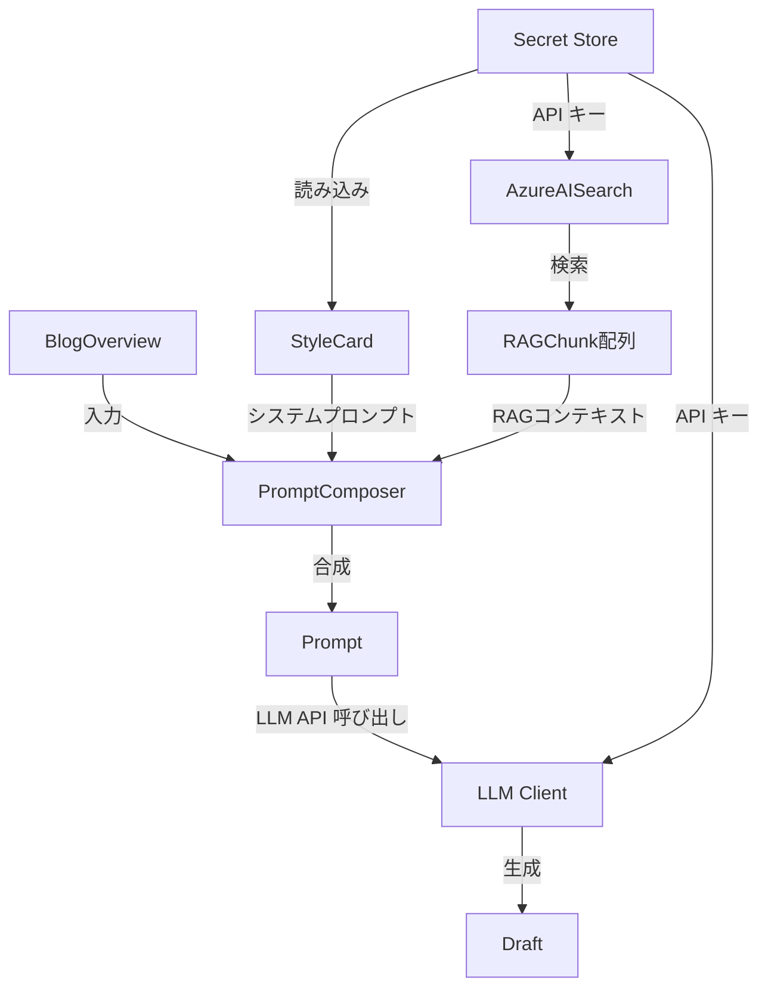
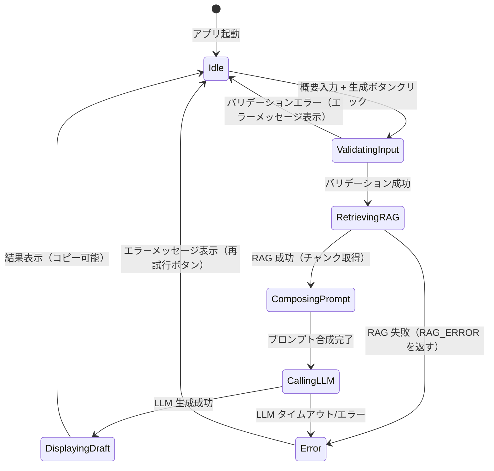

# Data Model: ブログ下書き生成 Web アプリケーション

**Branch**: `001-blog-draft-webapp` | **Date**: 2026-01-11  
**Purpose**: Phase 1 - エンティティとデータモデルの定義

## Overview

このドキュメントは、ブログ下書き生成 Web アプリケーションで使用されるドメインエンティティとデータ転送オブジェクト（DTO）を定義する。各エンティティの責務、バリデーションルール、相互関係を明示する。

---

## Core Entities（ドメインモデル）

### 1. BlogOverview（ブログ概要）

**目的**: ユーザーが入力する新規記事の概要情報。

#### Properties

| Property | Type | Required | Description |
|----------|------|----------|-------------|
| `Content` | `string` | ✅ | 記事の概要（タイトル案、目的、想定読者、手順の箇条書き等）。空でないこと、最大 5000 文字。 |

#### Validation Rules

- `Content` が空または null の場合、エラー: "記事の概要を入力してください"。
- `Content` が 5000 文字を超える場合、エラー: "概要は 5000 文字以内で入力してください"。

#### Example

```csharp
public class BlogOverview
{
    public string Content { get; set; } = string.Empty;
}
```

---

### 2. StyleCard（文体カード）

**目的**: LLM に送信する固定のシステムプロンプト。執筆方針、トーン、構成テンプレート、出力ルールを定義する。

#### Properties

| Property | Type | Required | Description |
|----------|------|----------|-------------|
| `Title` | `string` | ❌ | 文体カードのタイトル（例: "テックブログ執筆ガイド"）。UI 表示用（必須ではない）。 |
| `Content` | `string` | ✅ | 文体カード本文（Markdown 形式）。LLM にシステムプロンプトとして送信される。 |
| `SystemPrompt` | `string` | ✅ | LLM の system メッセージとして送信される役割定義（例: "あなたはテックブログの執筆アシスタントです"）。 |

#### Validation Rules

- `Content` が空または null の場合、エラーログを出力し、アプリケーションの起動を失敗させる（フォールバックは行わない）。
- `Content` が 10000 文字を超える場合、警告ログを出力（トークン数に注意）。

#### Example

```csharp
public class StyleCard
{
    public string? Title { get; set; }
    public string Content { get; set; } = string.Empty;
    public string SystemPrompt { get; set; } = string.Empty;
}
```

#### Security Note

- **秘匿情報**: 文体カードは Secret Store（Azure Key Vault 等）から読み込む。リポジトリや配布物に含めない。
- **ログ**: Content をログに記録しない。

---

### 3. RAGChunk（RAG チャンク）

**目的**: Azure AI Search から取得される過去記事の断片。

#### Properties

| Property | Type | Required | Description |
|----------|------|----------|-------------|
| `Text` | `string` | ✅ | チャンクの本文。最大 500 文字に整形される。 |
| `Score` | `double` | ✅ | ベクトル検索のスコア（0.0 ~ 1.0）。MinimumScore 閾値で除外判定に使用。 |
| `SourceTitle` | `string?` | ❌ | 出典記事のタイトル。 |
| `SourceUrl` | `string?` | ❌ | 出典記事の URL。 |

#### Validation Rules

- `Text` が空の場合、そのチャンクを除外。
- `Score` が設定の `MinimumScore` 未満の場合、そのチャンクを除外。

#### Example

```csharp
public class RAGChunk
{
    public string Text { get; set; } = string.Empty;
    public double Score { get; set; }
    public string? SourceTitle { get; set; }
    public string? SourceUrl { get; set; }
}
```

#### Azure AI Search インデックス フィールドマッピング

実装時は、Azure AI Search インデックスの以下のフィールドから `RAGChunk` へマッピングする：

| RAGChunk Property | Azure Search Field | Type | 説明 |
|---|---|---|---|
| `Text` | `chunk` | `Edm.String` | チャンク本文（検索可能、保存） |
| `Score` | （ベクトル検索スコア） | `double` | Azure AI Search が自動計算するスコア |
| `SourceTitle` | `title_Data_Column` | `Edm.String` | 出典記事のタイトル |
| `SourceUrl` | `metadata_storage_path` | `Edm.String` | 出典ドキュメントのパス（URL として使用） |

#### $select フィールド一覧

Azure AI Search のベクトル検索時、以下のフィールドを `$select` で指定する：

```
chunk, title_Data_Column, metadata_storage_path, search.score()
```

**注**: `search.score()` はスコアを取得するための特殊フィールド。Azure Search が自動的に計算する。

---

### 4. Prompt（プロンプト）

**目的**: LLM に送信される入力の集合体。システムプロンプト、RAG コンテキスト、ユーザー概要の 3 要素で構成される。

#### Properties

| Property | Type | Required | Description |
|----------|------|----------|-------------|
| `SystemMessage` | `string` | ✅ | LLM の system ロールに送信されるメッセージ（文体カード + システムプロンプト）。 |
| `RagContext` | `string` | ❌ | RAG チャンクを整形した文字列。RAG が無効または失敗した場合は空。 |
| `UserOverview` | `string` | ✅ | ユーザーが入力した新規記事の概要。 |

#### Derived Property

- `FullPrompt`: SystemMessage + RagContext + UserOverview を結合したプロンプト全文（プレビューモードで表示）。

#### Example

```csharp
public class Prompt
{
    public string SystemMessage { get; set; } = string.Empty;
    public string RagContext { get; set; } = string.Empty;
    public string UserOverview { get; set; } = string.Empty;

    public string FullPrompt => $"{SystemMessage}\n\n{RagContext}\n\n{UserOverview}";
}
```

---

### 5. Draft（下書き）

**目的**: LLM が生成した Markdown 形式のブログ記事本文。

#### Properties

| Property | Type | Required | Description |
|----------|------|----------|-------------|
| `Content` | `string` | ✅ | 生成された Markdown 本文。Mermaid 図やコードブロックを含む場合がある。 |
| `Model` | `string` | ✅ | 使用された LLM モデル ID（例: "gpt-4o"）。 |
| `GeneratedAt` | `DateTimeOffset` | ✅ | 生成日時（UTC）。 |
| `TokensUsed` | `int?` | ❌ | 使用されたトークン数（LLM レスポンスから取得可能な場合）。 |

#### Validation Rules

- JSON形式でない生成結果や `draft` が空の生成結果は成功扱いにせず、再試行可能な生成エラーとする。

#### Example

```csharp
public class Draft
{
    public string Content { get; set; } = string.Empty;
    public string Model { get; set; } = string.Empty;
    public DateTimeOffset GeneratedAt { get; set; }
    public int? TokensUsed { get; set; }
}
```

---

## Data Transfer Objects (DTOs)（API レイヤー）

### 1. GenerateDraftRequest

**目的**: `/draft` エンドポイントへのリクエスト。

#### Properties

| Property | Type | Required | Description |
|----------|------|----------|-------------|
| `Overview` | `string` | ✅ | ユーザーが入力した記事の概要（BlogOverview.Content に対応）。 |

#### Example

```csharp
public class GenerateDraftRequest
{
    [Required(ErrorMessage = "記事の概要を入力してください")]
    [MaxLength(5000, ErrorMessage = "概要は 5000 文字以内で入力してください")]
    public string Overview { get; set; } = string.Empty;
}
```

---

### 2. GenerateDraftResponse

**目的**: `/draft` エンドポイントからのレスポンス。

#### Properties

| Property | Type | Required | Description |
|----------|------|----------|-------------|
| `Draft` | `string` | ✅ | 生成された Markdown 下書き。 |
| `Model` | `string` | ✅ | 使用された LLM モデル ID。 |
| `GeneratedAt` | `DateTimeOffset` | ✅ | 生成日時（UTC）。 |
| `RagHitCount` | `int` | ✅ | RAG で取得されたチャンク数。 |
| `Warning` | `string?` | ❌ | 生成結果に関する任意の警告メッセージ。 |

#### Example

```csharp
public class GenerateDraftResponse
{
    public string Draft { get; set; } = string.Empty;
    public string Model { get; set; } = string.Empty;
    public DateTimeOffset GeneratedAt { get; set; }
    public int RagHitCount { get; set; }
    public string? Warning { get; set; }
}
```

---

### 3. PreviewPromptRequest

**目的**: `/draft/preview` エンドポイントへのリクエスト。

#### Properties

| Property | Type | Required | Description |
|----------|------|----------|-------------|
| `Overview` | `string` | ✅ | ユーザーが入力した記事の概要（GenerateDraftRequest と同一）。 |

#### Example

```csharp
public class PreviewPromptRequest
{
    [Required(ErrorMessage = "記事の概要を入力してください")]
    [MaxLength(5000, ErrorMessage = "概要は 5000 文字以内で入力してください")]
    public string Overview { get; set; } = string.Empty;
}
```

---

### 4. PreviewPromptResponse

**目的**: `/draft/preview` エンドポイントからのレスポンス。

#### Properties

| Property | Type | Required | Description |
|----------|------|----------|-------------|
| `Prompt` | `string` | ✅ | LLM に送信される予定のプロンプト全文（文体カード + RAG コンテキスト + ユーザー概要）。 |
| `RagHitCount` | `int` | ✅ | RAG で取得されたチャンク数。 |
| `Warning` | `string?` | ❌ | 警告メッセージ（将来的な拡張用途。現状は null）。 |

#### Example

```csharp
public class PreviewPromptResponse
{
    public string Prompt { get; set; } = string.Empty;
    public int RagHitCount { get; set; }
    public string? Warning { get; set; }
}
```

---

### 5. ErrorResponse

**目的**: API エラー時の統一レスポンス。

#### Properties

| Property | Type | Required | Description |
|----------|------|----------|-------------|
| `ErrorCode` | `string` | ✅ | エラーコード（例: "INVALID_REQUEST", "LLM_TIMEOUT", "CONFIG_ERROR"）。 |
| `Message` | `string` | ✅ | ユーザー向けエラーメッセージ。 |
| `Details` | `string?` | ❌ | 詳細情報（開発環境のみ含める）。 |
| `RequestId` | `string` | ✅ | リクエスト ID（ログ追跡用）。 |
| `IsRetryable` | `bool` | ✅ | 再試行可能なエラーかどうか。 |

#### Example

```csharp
public class ErrorResponse
{
    public string ErrorCode { get; set; } = string.Empty;
    public string Message { get; set; } = string.Empty;
    public string? Details { get; set; }
    public string RequestId { get; set; } = string.Empty;
    public bool IsRetryable { get; set; }
}
```

#### Error Codes

| Code | HTTP Status | User Message | Description |
|------|-------------|--------------|-------------|
| `INVALID_REQUEST` | 400 | 入力内容を確認してください | リクエストのバリデーションエラー |
| `CONFIG_ERROR` | 500 | システムが正しく構成されていません。管理者に連絡してください | API キー未設定、設定不備 |
| `LLM_TIMEOUT` | 504 | 生成に時間がかかりすぎています。もう一度お試しください | LLM API のタイムアウト |
| `LLM_ERROR` | 502 | LLM サービスでエラーが発生しました | LLM API の 5xx エラー |
| `RAG_ERROR` | 500 | 関連記事の検索に失敗しました | RAG 検索の失敗（フォールバックせず再試行可能なエラーとして返す） |

---

## Configuration Models（設定）

### 1. LlmOptions

**目的**: LLM API 接続設定。

#### Properties

| Property | Type | Required | Default | Description |
|----------|------|----------|---------|-------------|
| `Provider` | `string` | ✅ | "OpenAI" | プロバイダー名（例: "OpenAI", "AzureOpenAI"）。 |
| `ApiKey` | `string` | ✅ | - | API キー（Secret Store から読み込む）。 |
| `BaseUrl` | `string` | ❌ | OpenAI デフォルト | エンドポイント URL。 |
| `Model` | `string` | ✅ | - | モデル ID（例: "gpt-4o"）。 |
| `MaxTokens` | `int` | ✅ | 4096 | 応答の最大トークン数。 |
| `RequestTimeoutSeconds` | `int` | ✅ | 600 | タイムアウト時間（秒）。0 の場合は 600 を適用。 |
| `Parameters` | `Dictionary<string, string>?` | ❌ | - | 追加パラメータ（例: "reasoning_effort": "high"）。 |

#### Example

```csharp
public class LlmOptions
{
    public string Provider { get; set; } = "OpenAI";
    public string ApiKey { get; set; } = string.Empty;
    public string? BaseUrl { get; set; }
    public string Model { get; set; } = string.Empty;
    public int MaxTokens { get; set; } = 4096;
    public int RequestTimeoutSeconds { get; set; } = 600;
    public Dictionary<string, string>? Parameters { get; set; }
}
```

---

### 2. RagOptions

**目的**: Azure AI Search 接続設定。

#### Properties

| Property | Type | Required | Default | Description |
|----------|------|----------|---------|-------------|
| `Enabled` | `bool` | ✅ | true | RAG の有効/無効。 |
| `Endpoint` | `string` | ✅ (if Enabled) | - | Azure AI Search のエンドポイント URL。 |
| `ApiKey` | `string` | ✅ (if Enabled) | - | API キー（Secret Store から読み込む）。 |
| `IndexName` | `string` | ✅ (if Enabled) | - | 対象インデックス名。 |
| `TextFieldName` | `string` | ✅ (if Enabled) | - | 本文フィールド名（プロンプトに含める）。 |
| `VectorFieldName` | `string` | ✅ (if Enabled) | - | ベクトル検索対象フィールド名。 |
| `TopK` | `int` | ✅ | 5 | 取得件数。 |
| `MinimumScore` | `double` | ✅ | 0.7 | スコア閾値（これ未満のチャンクを除外）。 |

#### Example

```csharp
public class RagOptions
{
    public bool Enabled { get; set; } = true;
    public string Endpoint { get; set; } = string.Empty;
    public string ApiKey { get; set; } = string.Empty;
    public string IndexName { get; set; } = string.Empty;
    public string TextFieldName { get; set; } = string.Empty;
    public string VectorFieldName { get; set; } = string.Empty;
    public int TopK { get; set; } = 5;
    public double MinimumScore { get; set; } = 0.7;
}
```

#### 設定例（実装参考）

以下は実際の Azure AI Search インデックスに対応する具体的な設定値の例：

```json
{
  "Rag": {
    "Enabled": true,
    "Endpoint": "https://my-search-service.search.windows.net",
    "ApiKey": "secret-key-from-keyvault",
    "IndexName": "rag-1763523226614-azureOpenAi",
    "TextFieldName": "chunk",
    "VectorFieldName": "text_vector",
    "TopK": 5,
    "MinimumScore": 0.7
  }
}
```

**重要**: 
- `TextFieldName` は Azure AI Search インデックスの本文フィールド名（ここでは `chunk`）に統一する。アプリケーション側で `title` などのフィールドを直接指定してはならない。
- `VectorFieldName` はベクトル検索用フィールド（ここでは `text_vector`）を指定する。
- API 呼び出し時の `$select` には `TextFieldName` で指定したフィールドを含める（詳細は RAGChunk マッピング仕様を参照）。

---

### 3. StyleCardOptions

**目的**: 文体カード設定。

#### Properties

| Property | Type | Required | Default | Description |
|----------|------|----------|---------|-------------|
| `Title` | `string?` | ❌ | - | 文体カードのタイトル（UI 表示用）。 |
| `Content` | `string` | ✅ | - | 文体カード本文（Secret Store から読み込む）。 |
| `SystemPrompt` | `string` | ✅ | - | システムプロンプト（Secret Store から読み込む）。 |

#### Example

```csharp
public class StyleCardOptions
{
    public string? Title { get; set; }
    public string Content { get; set; } = string.Empty;
    public string SystemPrompt { get; set; } = string.Empty;
}
```

---

## Entity Relationships



---

## State Transitions（状態遷移）

### 下書き生成フロー



---

## Validation Summary

| Entity | Validation | Error Handling |
|--------|------------|----------------|
| BlogOverview | 空でない、最大 5000 文字 | HTTP 400、エラーメッセージ表示 |
| StyleCard | 起動時に存在確認 | エラーログを出力し、フォールバックなしで起動失敗 |
| RAGChunk | スコア閾値、空チェック | 除外（ログ記録） |
| Prompt | 各要素の存在確認 | エラーログ、生成中断 |
| Draft | 空でない JSON の `draft` | 形式不正時は再試行可能な生成エラー |

---

**次のステップ**: Phase 1 の contracts/ を作成し、API 仕様を OpenAPI で定義する。
