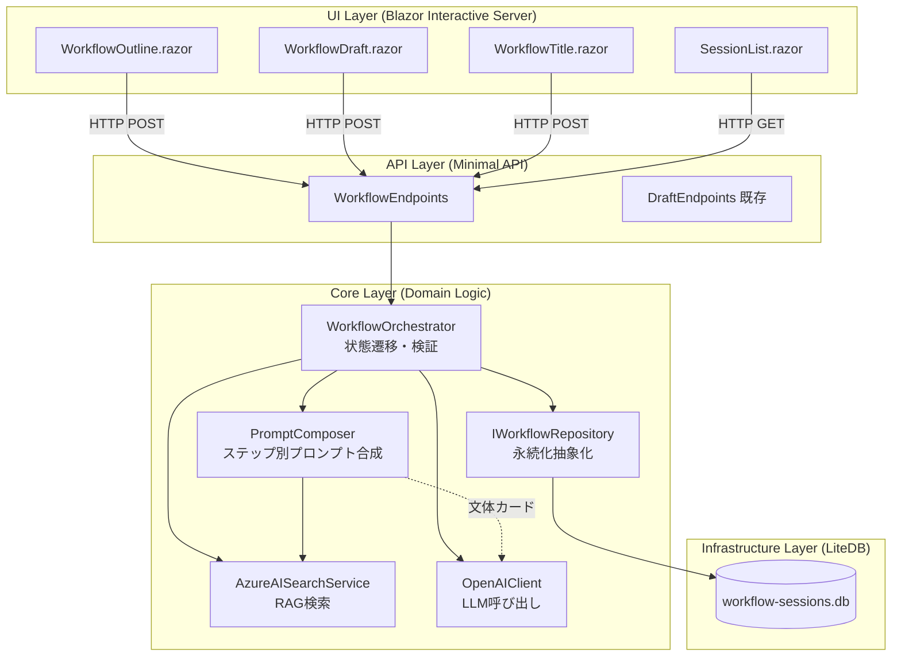
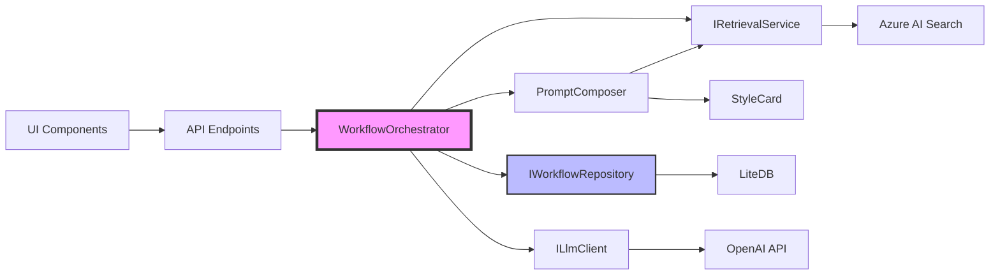
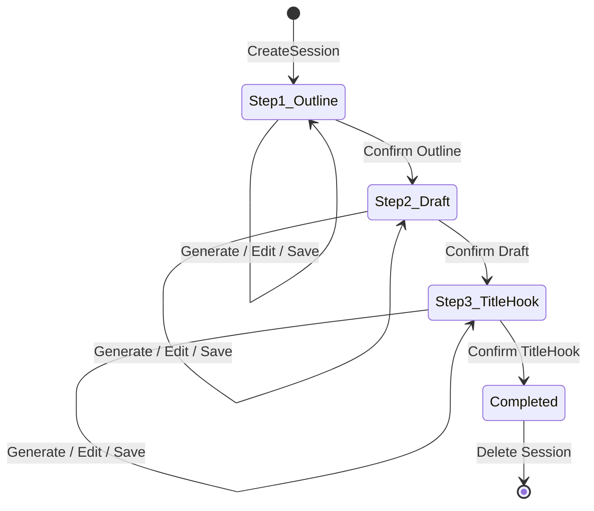

# Implementation Plan: ワークフロー型ブログ下書き生成（段階生成）

**Branch**: `002-workflow-draft-generation` | **Date**: 2026-02-05 | **Spec**: [spec.md](./spec.md)
**Input**: Feature specification from `/specs/002-workflow-draft-generation/spec.md`

**Note**: This plan was generated by the `/speckit.plan` command and includes Phase 0 (research.md) and Phase 1 (data-model.md, contracts/, quickstart.md) outputs.

## Summary

既存の「ブログ下書き生成 Web アプリケーション」（RAG + 文体カード + LLM で一発生成）を拡張し、**段階生成＋人間レビュー**を前提とした「ワークフロー型」にアップグレードする。ユーザーは、①アウトライン生成→編集→確定、②下書き生成→編集→確定、③タイトル＆導入部生成→編集→確定、の3段階で記事を作成する。**サーバー側でワークフロー状態と成果物を永続化**することで、ページリロードや再訪時でも途中から作業を再開できる。RAG検索結果は「スナップショット」として固定保存し、全ステップで同じコンテキストを使用することで、生成のたびに結果が揺れる問題を解決する。既存の実装方針（Blazor Interactive Server + API 同居のモジュラーモノリス、外部依存のインターフェース化、秘匿情報Secret Store、機微情報ログ禁止、プレビューモード）は維持し、新規にワークフローオーケストレーション、永続化、状態遷移検証、削除/保管期限管理を追加する。

## Technical Context

**Language/Version**: C# 12 / .NET 10（既存プロジェクトと同一）

**Primary Dependencies**:  
- **既存依存（継続使用）**:
  - Blazor Web App (Interactive Server モード)
  - ASP.NET Core Minimal API（既存エンドポイントは維持）
  - Azure.AI.OpenAI SDK（LLM 呼び出し）
  - Azure.Search.Documents SDK（RAG 検索）
  - Microsoft.Extensions.Configuration（設定管理）
  - Microsoft.Extensions.Logging（構造化ログ）
- **新規依存（ワークフロー永続化用）**:
  - **LiteDB**（ファイルベースの埋め込みデータベース、.NET 向け NoSQL）
    - 理由: 開発環境と本番環境で同じ仕組みを使用可能。SQLite より C# との親和性が高く、JSON シリアライズが容易。単一管理者運用に最適。
  - System.Text.Json（ワークフローデータのシリアライズ/デシリアライズ）

**Storage**:  
- **LiteDB ファイル**（`workflow-sessions.db`）: WorkflowSession、RagSnapshot、各ステップの成果物を保存
  - 格納場所: `./data/` ディレクトリ（appsettings.json で設定可能）
  - アクセス制御: OS レベルのファイルパーミッション（読み取り/書き込み権限を管理者のみに制限）
  - バックアップ: 定期的なファイルコピー（運用手順に記載）
  - 暗号化: 機微情報を含むが、暗号化は不要（ファイルアクセス制御で対応）。将来的に必要な場合は LiteDB の暗号化機能を使用可能

**Testing**: NUnit + Moq（既存テストピラミッドを拡張）
- **新規テスト対象**:
  - IWorkflowRepository（LiteDB アクセスのインターフェース）のモック化
  - WorkflowOrchestrator（状態遷移ロジック）のユニットテスト
  - ワークフローAPI（/workflow/sessions、/workflow/steps）の統合テスト
  - E2E テストで、セッション再開、編集、確定、削除のフロー検証

**Target Platform**: Azure App Service（Windows または Linux）、Docker コンテナ対応可（既存と同一）

**Project Type**: Web（Blazor Server + ASP.NET Core API、同一ホスト上のモジュラーモノリス）

**Performance Goals**:  
- WorkflowSession 保存/読み込み: 1 秒以内
- 各ステップの生成（LLM 処理時間を除く）: 2 秒以内
- 同時 10 ユーザーの負荷下で、レスポンス時間が単一ユーザー時の 1.5 倍以内
- セッション削除バッチ処理: 1 日 1 回（深夜 2 時）、10 秒以内に完了（100 セッション未満を想定）

**Constraints**:  
- **既存制約（継続）**:
  - タイムアウト: LLM 生成は 60 秒（既存は 600 秒だが、ワークフローでは各ステップが短いため調整）
  - ログ: ユーザー入力・RAG チャンク・プロンプト全文・生成結果は**本番・デバッグ環境共に記録禁止**
  - セキュリティ: API キー、外部サービスのエンドポイント URL、ユーザー名などの秘匿情報はブラウザに送信しない
  - 例外（プレビュー）: プレビューモードで表示する送信予定プロンプト全文は、文体カード・システムプロンプト・RAG取得情報を含めてクライアントへ返してよい（ただしログ/トレース記録は禁止）
- **新規制約（ワークフロー追加）**:
  - ステップ順序: アウトライン未確定→下書き生成不可、下書き未確定→タイトル生成不可（サーバー側で強制）
  - セッション保管期限: 作成から 30 日間（最終アクセス日時から計算）
  - セッション自動削除: 1 日 1 回バッチ処理で実行
  - RagSnapshot 固定: Step1 で取得した RAG 結果を全ステップで再利用（ユーザー操作で再検索可能）

- **新規制約（アウトライン短文化・レビュー容易性）**:
  - アウトラインは「長文の要約」ではなく、**レビュー・並べ替え・修正がしやすい骨組み**に限定する
  - 出力形式は **階層付きの箇条書きのみ**（Markdown の見出し・段落・番号付きリスト・コードブロック等は禁止）
  - 既定の出力サイズは **5〜15 行程度**、1 項目は **1〜2 行**に収める（厳密な強制はサーバ側の検証ルールで行う）
  - 形式/サイズ違反はフェイルファースト（自動で丸めたり整形して継続しない）

**Scale/Scope**:  
- 単一管理者（C# 技術者 1 名）が運用
- 同時ユーザー数 10 名以下を想定
- WorkflowSession 数: 最大 100 件程度（30 日自動削除で管理）
- 設定変更は環境変数または Secret Store で管理

## Constitution Check

*GATE: Must pass before Phase 0 research. Re-check after Phase 1 design.*

### 正常系優先と異常系の情報出力

- **要件**: 個人用ツールとして正常系優先、異常時は停止して良いが、解析・修正に必要なログ情報を出力すること。
- **評価**: ✅ PASS  
  - LLM API 失敗、RAG 失敗、タイムアウトに加え、**WorkflowSession 保存失敗、不正な状態遷移、セッション期限切れ**などの異常時も処理を中断し、詳細なエラーログ（例外情報、セッション ID、ステップ名、タイムスタンプ）を出力する設計。
  - 構造化ログ（`Microsoft.Extensions.Logging`）でトレーサビリティを確保。
  - **新規**: LiteDB の接続エラー、ファイル書き込みエラーも同様にログ出力し、フェイルファーストとする。

### コーディングルール

- **要件 1**: 全てのコードに対してビルド・コンパイル・静的チェックでコードに誤りが無いと証明すること。
- **評価**: ✅ PASS  
  - .NET コンパイラによる静的チェック、NUnit による単体テスト、CI での自動ビルド・テストを実施（既存と同一）。
  - **新規**: WorkflowRepository、WorkflowOrchestrator のユニットテストを追加。

- **要件 2**: 外部リソースや OS 依存処理は、テスト用の仕組み（スタブ化、一時フォルダ差し替え）を入れること。
- **評価**: ✅ PASS  
  - Azure AI Search、LLM API 呼び出しをインターフェース化し、UnitTest 時は Moq でスタブ化（既存と同一）。
  - **新規**: LiteDB アクセスを `IWorkflowRepository` インターフェースで抽象化し、テスト時はインメモリ実装またはモックで置き換え。IntegrationTest では一時ディレクトリに LiteDB ファイルを作成し、テスト後に削除。

### ガバナンス

- **要件 1**: GitHub パブリックリポジトリを使用するため、秘匿情報（API キー、エンドポイント URL、ユーザー名など）を一切コミットしないこと。
- **評価**: ✅ PASS  
  - 秘匿情報は Secret Store（Azure Key Vault 等）または User Secrets から読み込み、appsettings.json には含めない（既存と同一）。
  - 文体カード（StyleCard）はプロンプト構築に使用する設定データであり、リポジトリに含めない（既存と同一）。秘匿情報（アクセス情報）ではないが、運用上は機微情報として扱い、ログ/トレース記録を禁止する。
  - **新規**: WorkflowSession に含まれるユーザー入力、RAGチャンク、生成結果は機微情報だが、LiteDB ファイル自体はリポジトリに含めない（.gitignore に追加）。

- **要件 2**: 秘匿情報は、ログや画面への出力も禁止する。
- **評価**: ✅ PASS  
  - API キー、エンドポイント URL、文体カードはログに出力しない（既存と同一）。
  - **新規強化**: WorkflowSession の内容（ユーザー入力、アウトライン、下書き、タイトル、RAGチャンク、プロンプト）は**機微情報**として扱い、ログに記録しない。管理者ダッシュボードでも機微情報は表示せず、セッションID、作成日時、ステップ名、削除予定日のみ表示。
  - プレビューモードでプロンプト全文を画面に表示する際は、警告メッセージを表示し、ログには記録しない（既存と同一）。プレビュー表示に含める文体カード・システムプロンプト・RAG取得情報は秘匿情報ではない（ただし機微情報を含み得る）。

**結果**: 全ての Constitution 要件を満たしており、Phase 0 に進んで良い。

## Project Structure

### Documentation (this feature)

```text
specs/002-workflow-draft-generation/
├── plan.md              # This file (/speckit.plan command output)
├── research.md          # Phase 0 output (/speckit.plan command)
├── data-model.md        # Phase 1 output (/speckit.plan command)
├── quickstart.md        # Phase 1 output (/speckit.plan command)
├── contracts/           # Phase 1 output (/speckit.plan command)
│   └── openapi.yaml     # Workflow API 仕様
├── checklists/          # 品質チェックリスト
│   └── requirements.md  # 要件充足チェックリスト
└── tasks.md             # Phase 2 output (/speckit.tasks command - NOT created by /speckit.plan)
```

### Source Code (repository root)

```text
# Web application (Blazor Server + ASP.NET Core API on same host)
src/
├── BlogDraftWebApp/                  # Blazor Web App プロジェクト
│   ├── Components/                   # Blazor コンポーネント
│   │   ├── Pages/                    # ページ
│   │   │   ├── GenerateDraft.razor   # 【既存】単発生成UI
│   │   │   ├── WorkflowSession.razor # 【新規】ワークフローセッション管理UI
│   │   │   ├── WorkflowOutline.razor # 【新規】アウトライン生成・編集・確定UI
│   │   │   ├── WorkflowDraft.razor   # 【新規】下書き生成・編集・確定UI
│   │   │   ├── WorkflowTitle.razor   # 【新規】タイトル生成・編集・確定UI
│   │   │   └── SessionList.razor     # 【新規】管理者ダッシュボード（セッション一覧）
│   │   └── Layout/                   # レイアウトコンポーネント
│   ├── Program.cs                    # エントリポイント（DI、ミドルウェア設定）
│   ├── appsettings.json              # 設定（秘匿情報は含まない）
│   └── data/                         # 【新規】LiteDB ファイル格納ディレクトリ（.gitignore）
│       └── workflow-sessions.db      # WorkflowSession 永続化ファイル
│
├── BlogDraftWebApp.Core/             # ドメインロジック・コアサービス
│   ├── Models/                       # エンティティ
│   │   ├── BlogOverview.cs           # 【既存】記事概要
│   │   ├── StyleCard.cs              # 【既存】文体カード
│   │   ├── RAGChunk.cs               # 【既存】RAGチャンク
│   │   ├── Prompt.cs                 # 【既存】プロンプト
│   │   ├── Draft.cs                  # 【既存】下書き
│   │   ├── WorkflowSession.cs        # 【新規】ワークフローセッション
│   │   ├── RagSnapshot.cs            # 【新規】RAGスナップショット
│   │   ├── Outline.cs                # 【新規】アウトライン
│   │   ├── TitleHook.cs              # 【新規】タイトル＆導入部
│   │   └── WorkflowStep.cs           # 【新規】ステップ列挙型
│   ├── Services/                     # ビジネスロジック
│   │   ├── IPromptComposer.cs        # 【既存】プロンプト合成インターフェース
│   │   ├── PromptComposer.cs         # 【既存→拡張】プロンプト合成実装（ステップ別対応）
│   │   ├── IRetrievalService.cs      # 【既存】RAG 検索インターフェース
│   │   ├── AzureAISearchService.cs   # 【既存】Azure AI Search 実装
│   │   ├── ILlmClient.cs             # 【既存】LLM 呼び出しインターフェース
│   │   ├── OpenAIClient.cs           # 【既存】OpenAI 互換 API 実装
│   │   ├── IWorkflowRepository.cs    # 【新規】ワークフロー永続化インターフェース
│   │   ├── LiteDbWorkflowRepository.cs # 【新規】LiteDB 実装
│   │   ├── IWorkflowOrchestrator.cs  # 【新規】ワークフローオーケストレーションインターフェース
│   │   └── WorkflowOrchestrator.cs   # 【新規】ワークフロー状態遷移・検証実装
│   ├── Configuration/                # 設定モデル
│   │   ├── LlmOptions.cs             # 【既存】LLM 設定
│   │   ├── RagOptions.cs             # 【既存】RAG 設定
│   │   ├── StyleCardOptions.cs       # 【既存】文体カード設定
│   │   └── WorkflowOptions.cs        # 【新規】ワークフロー設定（保管期限、DB パス等）
│   └── Exceptions/                   # カスタム例外
│       ├── InvalidStateTransitionException.cs # 【新規】不正な状態遷移
│       └── SessionNotFoundException.cs        # 【新規】セッション未検出
│
├── BlogDraftWebApp.Api/              # REST API レイヤー（Minimal API）
│   ├── Endpoints/                    # エンドポイント定義
│   │   ├── DraftEndpoints.cs         # 【既存】/draft, /draft/preview
│   │   ├── WorkflowEndpoints.cs      # 【新規】ワークフローAPI
│   │   │   # /workflow/sessions (POST: 作成, GET: 一覧)
│   │   │   # /workflow/sessions/{id} (GET: 取得, DELETE: 削除)
│   │   │   # /workflow/sessions/{id}/steps/{step}/generate (POST: 生成)
│   │   │   # /workflow/sessions/{id}/steps/{step}/preview (POST: プレビュー)
│   │   │   # /workflow/sessions/{id}/steps/{step}/save (POST: 編集保存)
│   │   │   # /workflow/sessions/{id}/steps/{step}/confirm (POST: 確定)
│   │   └── HealthEndpoints.cs        # 【既存】ヘルスチェック
│   ├── Models/                       # リクエスト・レスポンス DTO
│   │   ├── GenerateDraftRequest.cs   # 【既存】単発生成リクエスト
│   │   ├── GenerateDraftResponse.cs  # 【既存】単発生成レスポンス
│   │   ├── PreviewPromptRequest.cs   # 【既存】プレビューリクエスト
│   │   ├── PreviewPromptResponse.cs  # 【既存】プレビューレスポンス
│   │   ├── CreateSessionRequest.cs   # 【新規】セッション作成リクエスト
│   │   ├── CreateSessionResponse.cs  # 【新規】セッション作成レスポンス
│   │   ├── GenerateStepRequest.cs    # 【新規】ステップ生成リクエスト
│   │   ├── GenerateStepResponse.cs   # 【新規】ステップ生成レスポンス
│   │   ├── SaveStepRequest.cs        # 【新規】編集保存リクエスト
│   │   ├── ConfirmStepRequest.cs     # 【新規】確定リクエスト
│   │   ├── GetSessionResponse.cs     # 【新規】セッション取得レスポンス
│   │   └── ErrorResponse.cs          # 【既存→拡張】エラーレスポンス（新エラーコード追加）
│   └── Middleware/                   # エラーハンドリング、ログ等
│       └── GlobalExceptionHandler.cs # 【既存→拡張】新例外型の捕捉
│
tests/
├── BlogDraftWebApp.Core.UnitTests/   # コアロジックの単体テスト
│   ├── Services/
│   │   ├── PromptComposerTests.cs    # 【既存→拡張】ステップ別プロンプト合成
│   │   ├── AzureAISearchServiceTests.cs # 【既存】
│   │   ├── OpenAIClientTests.cs      # 【既存】
│   │   ├── WorkflowOrchestratorTests.cs # 【新規】状態遷移検証
│   │   └── LiteDbWorkflowRepositoryTests.cs # 【新規】永続化テスト（一時DB使用）
│   └── Models/
│       ├── WorkflowSessionTests.cs   # 【新規】状態検証
│       └── RagSnapshotTests.cs       # 【新規】スナップショット検証
│
├── BlogDraftWebApp.Components.Tests/  # Blazor コンポーネントの単体テスト（bUnit）
│   ├── Pages/
│   │   ├── GenerateDraftTests.cs     # 【既存】
│   │   ├── WorkflowOutlineTests.cs   # 【新規】アウトラインUI
│   │   ├── WorkflowDraftTests.cs     # 【新規】下書きUI
│   │   └── WorkflowTitleTests.cs     # 【新規】タイトルUI
│   ├── Mocks/                        # モック
│   │   └── MockWorkflowRepository.cs # 【新規】
│   └── Fixtures/                     # フィクスチャ
│       └── WorkflowSessionFixture.cs # 【新規】
│
├── BlogDraftWebApp.Api.IntegrationTests/  # API の統合テスト
│   ├── DraftEndpointsTests.cs        # 【既存】
│   ├── WorkflowEndpointsTests.cs     # 【新規】ワークフローAPI
│   │   # - セッション作成/取得/削除
│   │   # - 各ステップの生成/プレビュー/保存/確定
│   │   # - ステップ順序違反の検証
│   │   # - セッション期限切れの検証
│   └── TestFixtures/                 # テスト用設定、スタブ
│       └── WorkflowTestFixture.cs    # 【新規】一時DB、モック設定
│
├── BlogDraftWebApp.E2E.Tests/        # E2E テスト（Playwright）
│   ├── Pages/
│   │   ├── GenerateDraftPageTests.cs # 【既存】
│   │   └── WorkflowJourneyTests.cs   # 【新規】ワークフロー全体のE2E
│   │   # - アウトライン→下書き→タイトルの完全フロー
│   │   # - 途中保存・再開
│   │   # - セッション削除
│   ├── Fixtures/
│   │   └── BrowserFixture.cs         # 【既存】
│   └── appsettings.e2e.json          # E2E テスト用設定
│
└── BlogDraftWebApp.Tests.Common/     # テスト共通ライブラリ（Moq ヘルパー等）
    └── TestHelpers/
        └── WorkflowSessionBuilder.cs # 【新規】テスト用セッション生成ヘルパー
```

**Structure Decision**: 既存のモジュラーモノリス構成を維持し、`BlogDraftWebApp.Core` にワークフロー関連のドメインロジック（WorkflowOrchestrator、WorkflowRepository）を追加。LiteDB ファイルは `BlogDraftWebApp/data/` ディレクトリに配置し、.gitignore で除外。API レイヤーには新規に `/workflow/` パスでワークフロー管理エンドポイントを追加。UI は既存の単発生成（GenerateDraft.razor）と並行して、ワークフロー用の複数ページ（WorkflowOutline.razor 等）を追加。テストピラミッドも既存構造を踏襲し、Unit/Integration/E2E の各レイヤーでワークフロー機能のテストを追加。

## Complexity Tracking

> **Fill ONLY if Constitution Check has violations that must be justified**

Constitution Check で違反は検出されなかったため、このセクションは空。

---

## Architecture Overview（アーキテクチャ概要）

### Layer Responsibilities（レイヤ責務）



### Component Responsibilities（コンポーネント責務）

| コンポーネント | 責務 | 主要メソッド |
|--------------|------|------------|
| **WorkflowOrchestrator** | ワークフロー全体のオーケストレーション。状態遷移検証、ステップ実行順序の保証、成果物の保存/確定を管理。 | `CreateSessionAsync`, `GenerateStepAsync`, `SaveEditAsync`, `ConfirmStepAsync`, `GetSessionAsync`, `DeleteSessionAsync` |
| **IWorkflowRepository** | WorkflowSession の永続化抽象化。CRUD 操作、期限切れセッション検索、バッチ削除を提供。 | `CreateAsync`, `GetByIdAsync`, `UpdateAsync`, `DeleteAsync`, `ListExpiredAsync`, `DeleteExpiredBatchAsync` |
| **LiteDbWorkflowRepository** | IWorkflowRepository の LiteDB 実装。JSON シリアライズでセッション保存、インデックスで高速検索。 | （実装詳細） |
| **PromptComposer（拡張）** | ステップ別のプロンプト合成。Step1 ではアウトライン生成指示、Step2 では下書き生成指示、Step3 ではタイトル生成指示を使い分ける。 | `ComposeAsync(step, overview, ragSnapshot, styleCard, outline?, draft?)` |
| **RagSnapshot** | Step1 で取得した RAG 検索結果を固定保存。全ステップで同じスナップショットを再利用してコンテキストの揺れを防ぐ。 | プロパティのみ（データクラス） |
| **WorkflowSession** | ワークフロー全体の状態と成果物を保持。CurrentStep、各ステップの Generated/Edited/Confirmed バージョン、RagSnapshotID を管理。 | `CanGenerateStep`, `CanConfirmStep`, `TransitionToStep` |

### Dependency Flow（依存関係フロー）



**設計原則**:
- **Single Responsibility**: 各コンポーネントは1つの責務に集中。状態管理は WorkflowOrchestrator、永持化は IWorkflowRepository、プロンプト合成は PromptComposer。
- **Dependency Inversion**: 外部依存（LiteDB、Azure AI Search、LLM）はインターフェースで抽象化し、テスト時にモック化可能。
- **Open/Closed**: PromptComposer はステップ種別を引数で受け取り、新しいステップ追加時も既存コードを変更しない設計（Strategy パターン的）。

---

## Data Model（データモデル）

### Core Entities（コアエンティティ）

#### 1. WorkflowSession（ワークフローセッション）

**目的**: 1つのブログ記事作成ワークフロー全体の状態と成果物を保持する集約ルート。

**Properties**:

| Property | Type | Required | Description |
|----------|------|----------|-------------|
| `SessionId` | `string` | ✅ | 一意識別子（GUID）|
| `CurrentStep` | `WorkflowStep` | ✅ | 現在のステップ（Step1_Outline / Step2_Draft / Step3_TitleHook / Completed） |
| `CreatedAt` | `DateTimeOffset` | ✅ | 作成日時（UTC） |
| `LastAccessedAt` | `DateTimeOffset` | ✅ | 最終アクセス日時（UTC）。保管期限計算に使用。 |
| `DeleteAt` | `DateTimeOffset` | ✅ | 自動削除予定日時（LastAccessedAt + 30日）|
| `InitialInput` | `BlogOverview` | ✅ | ユーザーの初期入力（記事の狙い、対象読者、論点） |
| `RagSnapshotId` | `string?` | ❌ | 関連する RagSnapshot の ID（Step1完了後に設定） |
| `OutlineGenerated` | `string?` | ❌ | 生成されたアウトライン（Step1） |
| `OutlineEdited` | `string?` | ❌ | ユーザー編集後のアウトライン（Step1） |
| `OutlineConfirmed` | `string?` | ❌ | 確定版アウトライン（Step1） |
| `DraftGenerated` | `string?` | ❌ | 生成された下書き（Step2） |
| `DraftEdited` | `string?` | ❌ | ユーザー編集後の下書き（Step2） |
| `DraftConfirmed` | `string?` | ❌ | 確定版下書き（Step2） |
| `TitleHookOptions` | `List<TitleHook>?` | ❌ | 生成されたタイトル＆導入部の候補リスト（最大3案、Step3） |
| `TitleHookSelected` | `TitleHook?` | ❌ | ユーザー選択＆編集後のタイトル＆導入部（Step3） |
| `TitleHookConfirmed` | `TitleHook?` | ❌ | 確定版タイトル＆導入部（Step3） |

**State Transition Methods**:

```csharp
public bool CanGenerateStep(WorkflowStep step)
{
    return step switch
    {
        WorkflowStep.Step1_Outline => true, // いつでも生成可能
        WorkflowStep.Step2_Draft => OutlineConfirmed != null, // アウトライン確定済み
        WorkflowStep.Step3_TitleHook => DraftConfirmed != null, // 下書き確定済み
        _ => false
    };
}

public bool CanConfirmStep(WorkflowStep step)
{
    return step switch
    {
        WorkflowStep.Step1_Outline => OutlineEdited != null || OutlineGenerated != null,
        WorkflowStep.Step2_Draft => DraftEdited != null || DraftGenerated != null,
        WorkflowStep.Step3_TitleHook => TitleHookSelected != null || (TitleHookOptions?.Count > 0),
        _ => false
    };
}

public void TransitionToStep(WorkflowStep newStep)
{
    if (!CanGenerateStep(newStep))
    {
        throw new InvalidStateTransitionException($"Cannot transition to {newStep} from {CurrentStep}");
    }
    CurrentStep = newStep;
    LastAccessedAt = DateTimeOffset.UtcNow;
    DeleteAt = LastAccessedAt.AddDays(30);
}
```

**LiteDB Index**:
- Primary Key: `SessionId`
- Index: `DeleteAt` (期限切れセッション検索用)
- Index: `LastAccessedAt` (管理者ダッシュボード並び替え用)

---

#### 2. RagSnapshot（RAGスナップショット）

**目的**: 特定時点の RAG 検索結果を固定保存し、全生成ステップで同じコンテキストを使用する。

**Properties**:

| Property | Type | Required | Description |
|----------|------|----------|-------------|
| `SnapshotId` | `string` | ✅ | 一意識別子（GUID） |
| `SearchQuery` | `string` | ✅ | 検索クエリ文字列（ユーザー入力から生成） |
| `SearchExecutedAt` | `DateTimeOffset` | ✅ | 検索実行日時（UTC） |
| `Chunks` | `List<RAGChunk>` | ✅ | ヒットしたチャンクのリスト（Top-K、スコア閾値適用済み） |
| `ChunkCount` | `int` | ✅ | ヒットしたチャンク数（Chunks.Count と同じ、冗長だが表示用） |

**Relationship**: WorkflowSession から RagSnapshotId で参照される（1:1 関係）。

**Serialization**: LiteDB に JSON として保存。RAGChunk 配列も含めて完全にシリアライズ。

**LiteDB Index**:
- Primary Key: `SnapshotId`
- （WorkflowSession からの参照のみなので、追加インデックス不要）

---

#### 3. Outline（アウトライン）

**目的**: ブログ記事の構成（章立て＋箇条書き）を表現する。WorkflowSession のプロパティ（string）として保存されるが、論理的には独立したエンティティ。

**Format**: Markdown 形式のテキスト。

**Example**:
```markdown
## 第1章: はじめに
- 背景と課題
- 本記事の目的

## 第2章: 技術概要
- アーキテクチャ
- 主要コンポーネント

## 第3章: 実装手順
- ステップ1: 環境構築
- ステップ2: コード実装
```

**Validation（短文化・編集容易性を優先）**: UI とサーバー側で検証。
- 形式: 階層付き箇条書きのみ（`-` で開始）。見出し（`#`）や段落文は禁止。
- 行数: 既定 5〜15 行（設定で変更可能）。
- 階層: 深さは最大 2（親 → 子）まで（設定で変更可能）。
- 1 行の長さ: 既定 最大 120 文字（設定で変更可能）。
- 総文字数: 最大 2000 文字（設定で変更可能）。
- 違反時: サーバは `INVALID_REQUEST`（または専用コード）として失敗を返し、再生成/修正を促す（自動整形しない）。

---

#### 4. Draft（下書き）

**目的**: ブログ記事本文を表現する。WorkflowSession のプロパティ（string）として保存。

**Format**: Markdown 形式のテキスト（Mermaid 図、コードブロックを含む可能性あり）。

**Validation**: 最小 100 文字、最大 50000 文字（UI とサーバー側で検証）。

---

#### 5. TitleHook（タイトル＆導入部）

**目的**: 記事のタイトルと導入部（冒頭〜第1章）の組み合わせを表現する。

**Properties**:

| Property | Type | Required | Description |
|----------|------|----------|-------------|
| `Title` | `string` | ✅ | タイトル文字列（最大 200 文字） |
| `HookText` | `string` | ✅ | 導入部のテキスト（Markdown 形式、最大 2000 文字） |
| `OptionIndex` | `int` | ❌ | 候補番号（1〜3）。複数案がある場合に使用。 |

**Serialization**: WorkflowSession の `TitleHookOptions`（List）または `TitleHookSelected/Confirmed`（単一オブジェクト）として保存。

---

### WorkflowStep Enum（ステップ列挙型）

```csharp
public enum WorkflowStep
{
    Step1_Outline = 1,    // アウトライン生成・編集・確定
    Step2_Draft = 2,      // 下書き生成・編集・確定
    Step3_TitleHook = 3,  // タイトル＆導入部生成・編集・確定
    Completed = 4         // 全ステップ完了
}
```

---

### State Diagram（状態遷移図）



**遷移ルール**:
- Step1 → Step2: アウトライン確定必須
- Step2 → Step3: 下書き確定必須
- 逆方向の遷移（Step2 → Step1 等）は不可
- 各ステップ内での Generate / Edit / Save は自由に繰り返し可能

---

### Configuration Models（設定モデル）

#### WorkflowOptions

**目的**: ワークフロー機能の設定。

**Properties**:

| Property | Type | Required | Default | Description |
|----------|------|----------|---------|-------------|
| `DatabasePath` | `string` | ✅ | "./data/workflow-sessions.db" | LiteDB ファイルのパス |
| `SessionRetentionDays` | `int` | ✅ | 30 | セッション保管期限（日数） |
| `CleanupSchedule` | `string` | ✅ | "0 2 * * *" | 自動削除バッチのCron式（デフォルト: 毎日午前2時） |
| `MaxSessionsPerUser` | `int?` | ❌ | null | 1ユーザーあたりの最大セッション数（nullは無制限） |
| `OutlineMinLines` | `int` | ✅ | 5 | Step1 アウトラインの最小行数 |
| `OutlineMaxLines` | `int` | ✅ | 15 | Step1 アウトラインの最大行数 |
| `OutlineMaxDepth` | `int` | ✅ | 2 | Step1 アウトラインの最大階層深さ |
| `OutlineMaxLineLength` | `int` | ✅ | 120 | Step1 アウトラインの1行最大文字数 |
| `OutlineMaxTotalChars` | `int` | ✅ | 2000 | Step1 アウトラインの最大総文字数 |
| `OutlineMaxOutputTokens` | `int` | ✅ | 350 | Step1 アウトライン生成の最大出力トークン（LLM 側の上限） |

**Example**:
```json
{
  "Workflow": {
    "DatabasePath": "./data/workflow-sessions.db",
    "SessionRetentionDays": 30,
    "CleanupSchedule": "0 2 * * *",
   "MaxSessionsPerUser": null,
   "OutlineMinLines": 5,
   "OutlineMaxLines": 15,
   "OutlineMaxDepth": 2,
   "OutlineMaxLineLength": 120,
   "OutlineMaxTotalChars": 2000,
   "OutlineMaxOutputTokens": 350
  }
}
```

---

## Step1（アウトライン）出力を強制するための実装方針（Plan 強化）

### 目的

アウトラインは「生成品質の早期検出・軌道修正」のための骨組みであり、本文/説明の生成を避ける。レビューや並べ替えがしやすいように、**短い階層付き箇条書き**に出力を強制する。

### 施策（まとめて手を打つ）

1. **プロンプトの出力契約を明文化（最優先）**
  - 例（方針）:
    - 「出力は `-` で始まる箇条書きのみ」
    - 「合計 5〜15 行、深さ最大 2」
    - 「1項目は1行（長くても2行）、説明文は禁止」
    - 「見出し `#`、番号付き、段落、コードブロック、引用、前置き/後書きは禁止」
  - `PromptComposer` は Step1 専用のテンプレートを持ち、上記の禁止事項と上限を毎回プロンプトに含める。

2. **LLM 生成パラメータで“止める”**
  - Step1 は `max_output_tokens`（または SDK 相当の上限）を小さく設定し、長文化を物理的に抑制する（`WorkflowOptions.OutlineMaxOutputTokens`）。
  - 温度/多様性は過度に上げない（長文化や脱線の確率が上がるため）。

3. **サーバ側のフォーマット/サイズ検証（フェイルファースト）**
  - 生成結果を保存する前に、以下を検証する:
    - 行数が範囲内
    - 全行が箇条書き（`-` またはインデント＋`-`）
    - 深さが `OutlineMaxDepth` 以下
    - `#` で始まる見出し、空行連発、段落文の混入がない
    - 1行/総文字数が上限内
  - 違反した場合は **自動トリミング/自動整形はせず**、エラーとして返す（ルール違反をユーザーに見える形で早期検出する）。

4. **RAG の“渡し方”を Step1 用に絞る**
  - Step1 では RAG チャンク全文をそのまま渡さず、チャンク数や1チャンクの文字数を強く制限する（検索結果が多いほど章立てが増殖しやすいため）。
  - 目的は「骨組みの方向性」なので、詳細根拠は Step2 以降で厚くする。

5. **（任意・将来）構造化出力（JSON Schema 等）への移行**
  - さらに強い強制が必要な場合、Step1 の出力を JSON（例: `[{"title":"...","bullets":[...]}]`）で返させ、サーバで Markdown 箇条書きにレンダリングする。
  - パース失敗/制約違反はエラーとして返す（フォールバックしない）。

---

## API Design（API設計）

### Workflow API Endpoints（ワークフローAPI一覧）

#### 1. セッション管理

##### POST /workflow/sessions

**Purpose**: 新しいワークフローセッションを作成する。

**Request**:
```json
{
  "overview": "記事の狙い、対象読者、論点などを含む初期入力"
}
```

**Response** (201 Created):
```json
{
  "sessionId": "550e8400-e29b-41d4-a716-446655440000",
  "currentStep": "Step1_Outline",
  "createdAt": "2026-02-05T10:00:00Z",
  "deleteAt": "2026-03-07T10:00:00Z"
}
```

---

##### GET /workflow/sessions/{sessionId}

**Purpose**: 指定されたセッションの詳細を取得する。

**Response** (200 OK):
```json
{
  "sessionId": "550e8400-e29b-41d4-a716-446655440000",
  "currentStep": "Step2_Draft",
  "createdAt": "2026-02-05T10:00:00Z",
  "lastAccessedAt": "2026-02-05T12:30:00Z",
  "deleteAt": "2026-03-07T12:30:00Z",
  "initialInput": "...",
  "ragSnapshotId": "abc-123",
  "outlineConfirmed": "## 第1章...",
  "draftGenerated": "# タイトル\n\n本文...",
  "draftEdited": null,
  "draftConfirmed": null
}
```

**Error** (404 Not Found):
```json
{
  "errorCode": "SESSION_NOT_FOUND",
  "message": "セッションが見つかりません",
  "requestId": "req-123",
  "isRetryable": false
}
```

---

##### DELETE /workflow/sessions/{sessionId}

**Purpose**: 指定されたセッションを削除する（ユーザー手動削除）。

**Response** (204 No Content): 本文なし

---

##### GET /workflow/sessions

**Purpose**: 全セッションの一覧を取得する（管理者ダッシュボード用）。

**Query Parameters**:
- `page` (default: 1): ページ番号
- `pageSize` (default: 20): 1ページあたりの件数

**Response** (200 OK):
```json
{
  "sessions": [
    {
      "sessionId": "550e8400-e29b-41d4-a716-446655440000",
      "currentStep": "Step2_Draft",
      "createdAt": "2026-02-05T10:00:00Z",
      "lastAccessedAt": "2026-02-05T12:30:00Z",
      "deleteAt": "2026-03-07T12:30:00Z"
    }
  ],
  "totalCount": 42,
  "page": 1,
  "pageSize": 20
}
```

**Note**: 機微情報（initialInput、成果物）は含めない。

---

#### 2. ステップ生成

##### POST /workflow/sessions/{sessionId}/steps/{step}/generate

**Purpose**: 指定されたステップの成果物を生成する（LLM呼び出し）。

**Path Parameters**:
- `step`: `outline` | `draft` | `titlehook`

**Request** (Step1 Outline):
```json
{
  "regenerate": false  // true の場合、既存の生成結果を破棄して再生成
}
```

**Response** (200 OK):
```json
{
  "sessionId": "550e8400-e29b-41d4-a716-446655440000",
  "step": "outline",
  "generated": "## 第1章: はじめに\n- 背景...",
  "ragHitCount": 5,
  "model": "gpt-4o",
  "generatedAt": "2026-02-05T10:05:00Z"
}
```

**Error** (400 Bad Request - ステップ順序違反):
```json
{
  "errorCode": "INVALID_STEP_TRANSITION",
  "message": "アウトラインを先に確定してください",
  "requestId": "req-456",
  "isRetryable": false
}
```

---

##### POST /workflow/sessions/{sessionId}/steps/{step}/preview

**Purpose**: 指定されたステップのプロンプト全文をプレビュー表示する（LLM呼び出しなし）。

**Request**:
```json
{}
```

**Response** (200 OK):
```json
{
  "sessionId": "550e8400-e29b-41d4-a716-446655440000",
  "step": "draft",
  "prompt": "[システムプロンプト]\n下書きを生成してください...\n\n[RAGコンテキスト]\n## 過去記事...\n\n[アウトライン]\n## 第1章...",
  "ragSnapshotId": "abc-123",
  "warning": "⚠️ この内容は機微情報を含みます。共有しないでください"
}
```

**Note**: プロンプト内容はログに記録しない。

---

#### 3. 編集と確定

##### POST /workflow/sessions/{sessionId}/steps/{step}/save

**Purpose**: ユーザーが編集した内容を保存する（確定前の一時保存）。

**Request** (Step1 Outline):
```json
{
  "editedContent": "## 第1章: はじめに（編集版）\n- 背景...(追記)"
}
```

**Response** (200 OK):
```json
{
  "sessionId": "550e8400-e29b-41d4-a716-446655440000",
  "step": "outline",
  "saved": true
}
```

---

##### POST /workflow/sessions/{sessionId}/steps/{step}/confirm

**Purpose**: 編集した内容を確定し、次のステップに進める状態にする。

**Request** (Step1 Outline):
```json
{
  "confirmedContent": "## 第1章: はじめに（確定版）\n- 背景..."
}
```

**Response** (200 OK):
```json
{
  "sessionId": "550e8400-e29b-41d4-a716-446655440000",
  "step": "outline",
  "confirmed": true,
  "nextStep": "draft"
}
```

---

### Error Codes（エラーコード）

| Code | HTTP Status | User Message | Description |
|------|-------------|--------------|-------------|
| `SESSION_NOT_FOUND` | 404 | セッションが見つかりません | 指定されたセッションIDが存在しない |
| `SESSION_EXPIRED` | 410 | セッションの有効期限が切れています | 30日経過して自動削除された |
| `INVALID_STEP_TRANSITION` | 400 | [ステップ名]を先に確定してください | ステップ順序違反（例: アウトライン未確定で下書き生成） |
| `INVALID_REQUEST` | 400 | 入力内容を確認してください | リクエストバリデーションエラー |
| `OUTLINE_CONSTRAINT_VIOLATION` | 400 | アウトラインが長すぎる/形式が不正です | Step1 の形式（箇条書きのみ）/行数/階層/文字数の制約違反 |
| `SESSION_BUSY` | 409 | 生成中です。しばらくお待ちください | 同一セッションに対する操作が処理中（排他制御） |
| `STORAGE_ERROR` | 500 | セッションの保存に失敗しました | LiteDB書き込みエラー |
| `CONFIG_ERROR` | 500 | システムが正しく構成されていません | 設定不備（既存と同じ） |
| `LLM_TIMEOUT` | 504 | 生成に時間がかかりすぎています | LLM タイムアウト（既存と同じ） |
| `LLM_ERROR` | 502 | LLM サービスでエラーが発生しました | LLM API エラー（既存と同じ） |
| `RAG_ERROR` | 500 | 関連記事の検索に失敗しました | RAG検索失敗（既存と同じ） |
